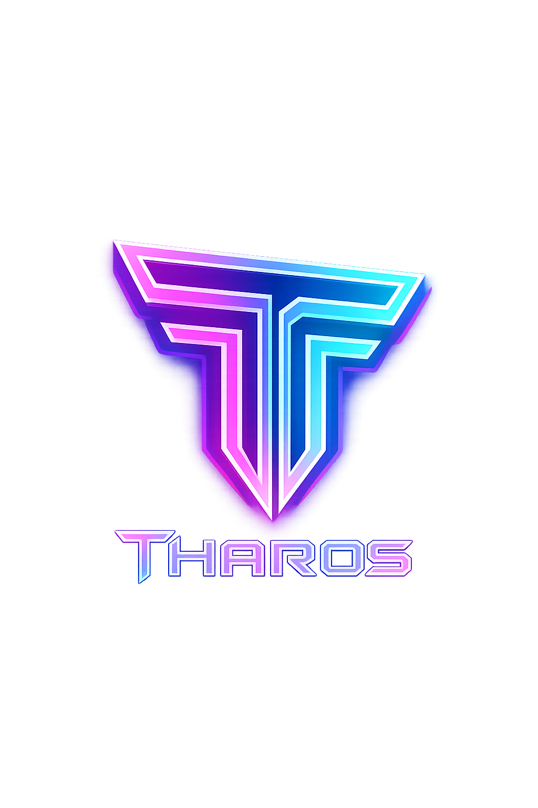

<div align="center">
  
  
  # Tharos

**Modern AI-Powered Git Hook Security Scanner**

Tharos is a specialized git commit hook scanner that acts as an intelligent gatekeeper for your codebase. It combines lightning-fast AST analysis with deep AI semantic insights to catch security vulnerabilities and leaks *before* they are committed to your repository.


[](LICENSE)
[](https://www.typescriptlang.org/)
[](https://golang.org/)

</div>

## ✨ Features

### 🛡️ Core: Intelligent Git Hooks
Tharos's primary interface is your git workflow. It provides automated security gating that prevents high-risk code from ever leaving your machine.
- **Pre-commit Gating**: Block commits containing secrets, SQLi, or high-risk vulnerabilities.
- **Polyglot AST Support**: Native semantic analysis for **TypeScript, JavaScript, Go, and Python**.
- **Interactive Magic Fixes**: Collaboratively review, fix, or explain findings in the CLI or VS Code.
- **Policy-as-Code**: Load organizational security policies from YAML (SOC2, GDPR, OWASP).

### 🧩 VS Code Extension (v1.0.2)
- **Zero-Config**: Bundled binaries for Windows, macOS, and Linux. No installation required.
- **Magic Fixes**: Lightbulb icons propose AI-powered security patches directly in your editor.
- **Precise Highlighting**: Native squiggly lines point to the exact token causing the risk.
- **Scan-on-Open**: Instant feedback the moment you open a file.

### 🔒 AI-Powered Security Analysis
- **AST-Based Detection**: Fast, accurate pattern matching for common vulnerabilities (SQLi, XSS, Secrets).
- **Scanner Mindset**: Context-aware analysis that ignores test files and mock data.
- **AI Semantic Analysis**: Deep understanding of code context and intent using Gemini/Groq.
- **Risk Scoring**: Intelligent commit blocking based on cumulative finding severity and AI risk scores.
- **Suggested Fixes**: AI-generated code snippets to resolve issues instantly.


#### 4. GitHub Actions (Official Action)
Integrate Tharos directly into your GitHub Security dashboard:

```yaml
- uses: actions/checkout@v4
- name: Tharos Security Scan
  uses: ./tharos-action # In your repo use collabchron/tharos/tharos-action@v1
  with:
    path: '.'
    ai: true
    sarif: 'results.sarif'
```
This automatically uploads findings to the **Security** tab of your repository.

### 🧠 AI Provider Flexibility
Automatic fallback chain:
1. **Google Gemini** (Recommended, generous free tier)
2. **Groq** (Fast & Free inference)
3. **Managed AI** (Zero-config cloud fallback)

## 📦 Installation

### NPM (Recommended)
```bash
npm install -g @collabchron/tharos
```

### From Source
```bash
git clone https://github.com/chinonsochikelue/tharos.git
cd tharos
npm install
npm run build
npm link
```

## 🚀 Quick Start

### 1. Initialize Your Project
```bash
cd your-project
tharos init
```

This creates:
- `tharos.yaml` - Configuration file
- `.git/hooks/pre-commit` - Automatic validation
- `.git/hooks/pre-push` - CI/CD enforcement

### 2. Configure Your Policy
Choose a pre-built policy or create your own:

```bash
# Use OWASP Top 10
cp node_modules/tharos/policies/owasp-top10.yaml tharos.yaml

# Use SOC 2
cp node_modules/tharos/policies/soc2.yaml tharos.yaml

# Use GDPR
cp node_modules/tharos/policies/gdpr.yaml tharos.yaml
```

### 3. Set Up AI Providers (Optional but Recommended)

Tharos works without AI but provides **deeper insights** with it enabled. Choose either provider (both have free tiers):

#### 🧠 Option 1: Google Gemini (Recommended)
**Best for:** Powerful analysis, generous free tier

```bash
# Get your API key from https://makersuite.google.com/app/apikey
export GEMINI_API_KEY="your-gemini-key-here"

# Or on Windows PowerShell:
$env:GEMINI_API_KEY="your-gemini-key-here"
```

#### ⚡ Option 2: Groq (Fast & Free)
**Best for:** Speed, low latency

```bash
# Get your free API key from https://console.groq.com
export GROQ_API_KEY="your-groq-key-here"

# Or on Windows PowerShell:
$env:GROQ_API_KEY="your-groq-key-here"
```

**Check your setup:**
```bash
tharos setup
```


### 4. Run Analysis
```bash
# Check all staged files
tharos check

# Analyze specific file
tharos analyze src/api/auth.ts

# Interactive review (Fix/Explain/Skip findings)
tharos analyze . --interactive
```

---

### 🧪 Automated Testing
Tharos includes a built-in test suite to verify security policies and engine performance.
```bash
# Run the automated security test suite
node scripts/run-tests.cjs
```
This suite tests Tharos against the `audit_samples/` directory, ensuring no regressions in vulnerability detection.

## 📋 Configuration

### `tharos.yaml` Example
```yaml
name: "My Project Security Policy"
version: "1.0.0"

# Built-in AST analysis is ALWAYS enabled for TS, JS, Go, and Python.
# You can add custom regex patterns under the security section.

security:
  enabled: true
  rules:
    - pattern: "DANGEROUS_INTERNAL_API"
      message: "Internal API bypass detected"
      severity: "critical"

# AI configuration
ai:
  enabled: true
  provider: "auto"     # auto, ollama, gemini, groq
  min_risk_score: 60   # Filter noise; only show high-confidence AI insights
```


## 🔧 VSCode Extension

### Installation
1. Open VSCode
2. Press `Ctrl+Shift+X` (Extensions)
3. Search for "Tharos"
4. Click Install

### Features
- **Real-time Analysis**: See issues as you save
- **Hover Insights**: Rich tooltips with AI recommendations
- **Quick Fixes**: Apply suggested changes with one click
- **Status Bar**: Live issue counter

### Configuration
```json
{
  "tharos.enableAI": true,
  "tharos.severity": "warning",
  "tharos.corePath": ""  // Auto-detected
}
```

## 📚 Policy Library

Tharos includes comprehensive pre-built policies:

| Policy | Description | Rules | Use Case |
|--------|-------------|-------|----------|
| `owasp-top10.yaml` | OWASP Top 10 2021 | 50+ | General web security |
| `soc2.yaml` | SOC 2 Type II | 40+ | SaaS compliance |
| `gdpr.yaml` | GDPR Compliance | 35+ | EU data protection |
| `pci-dss.yaml` | PCI-DSS v4.0 | 45+ | Payment processing |
| `code-quality.yaml` | Best Practices | 60+ | Code maintainability |

## 🏗️ Architecture

```
┌─────────────────────────────────────────┐
│           Tharos Ecosystem              │
├─────────────────────────────────────────┤
│                                         │
│  ┌──────────┐  ┌──────────┐  ┌───────┐  │
│  │   CLI    │  │  VSCode  │  │GitHub │  │
│  │   Tool   │  │Extension │  │Action │  │
│  └────┬─────┘  └────┬─────┘  └───┬───┘  │
│       │             │             │     │
│       └─────────────┼─────────────┘     │
│                     │                   │
│            ┌────────▼────────┐          │
│            │  tharos-core    │          │
│            │  (Go Binary)    │          │
│            │ - AST Analysis  │          │
│            │ - AI Integration│          │
│            └────────┬────────┘          │
│                     │                   │
│                     │                   │
│       ┌───────────────────────────┐     │
│       │                           │     │
│  ┌────▼────┐                 ┌────▼───┐ │
│  │ Gemini  │                 │  Groq  │ │
│  │ (Cloud) │                 │(Cloud) │ │
│  └─────────┘                 └────────┘ │
└─────────────────────────────────────────┘
```

## 🤝 Contributing

We welcome contributions! Please see [CONTRIBUTING.md](CONTRIBUTING.md) for guidelines.

### Development Setup
```bash
# Clone repository
git clone https://github.com/chinonsochikelue/tharos.git
cd tharos

# Install dependencies
npm install

# Build Go core
cd go-core
go build -o tharos-core.exe main.go

# Build CLI
cd ..
npm run build

# Run tests
npm test
```

## 📖 Documentation

Full documentation available at [https://tharos.vercel.app](https://tharos.vercel.app)

- [Getting Started Guide](https://tharos.vercel.app/docs)
- [Policy Configuration](https://tharos.vercel.app/docs/policies)
- [AI Integration](https://tharos.vercel.app/docs/quickstart#2-configure-ai-recommended)
- [VSCode Extension](https://tharos.vercel.app/docs/vscode)
- [API Reference](https://tharos.vercel.app/docs/api)

## 🎯 Use Cases

### Startup / Small Team
```bash
# Quick setup with OWASP
tharos init
cp policies/owasp-top10.yaml tharos.yaml
export GROQ_API_KEY="your-key"
```

### Enterprise / Compliance-Focused
```bash
# SOC 2 + GDPR + PCI-DSS
tharos init
# Combine multiple policies in tharos.yaml
# Set up managed AI endpoint
export THAROS_MANAGED_KEY="your-enterprise-key"
```

### Open Source Project
```bash
# Code quality focus
tharos init
cp policies/code-quality.yaml tharos.yaml
```

## 🔐 Security

Tharos takes security seriously:
- **Local-First**: AST analysis runs entirely locally
- **Privacy**: AI analysis is optional and configurable
- **No Data Collection**: We don't collect or store your code
- **Open Source**: Full transparency, audit the code yourself

## 📊 Performance

- **AST Analysis**: < 100ms for typical files
- **AI Insights**: < 2s with Groq, < 5s with Gemini
- **VSCode Extension**: No UI blocking, async analysis
- **Git Hooks**: < 1s for pre-commit checks

## 🗺️ Roadmap

- [ ] Additional language support (C++, C#, PHP, Ruby)
- [ ] Cloud dashboard for team management
- [ ] Custom rule builder UI
- [ ] IDE integrations (JetBrains, Sublime)
- [ ] CI/CD platform integrations (GitLab, CircleCI)
- [ ] Machine learning model training on your codebase

## 📄 License

MIT License - see [LICENSE](LICENSE) for details

## 🙏 Acknowledgments

- OWASP for security guidelines
- Google Gemini team for AI capabilities
- Groq for fast inference
- The open-source community

## 💬 Support

- **Documentation**: [https://tharos.vercel.app](https://tharos.vercel.app)
- **Issues**: [GitHub Issues](https://github.com/chinonsochikelue/tharos/issues)
- **Discussions**: [GitHub Discussions](https://github.com/chinonsochikelue/tharos/discussions)
- **Discord**: [Join our community](https://discord.gg/tharos)
- **Sponsor**: [GitHub Sponsors](https://github.com/sponsors/chinonsochikelue)

---

**Built with ❤️ by developers, for developers**

🦊 **Tharos** - Because security shouldn't slow you down
