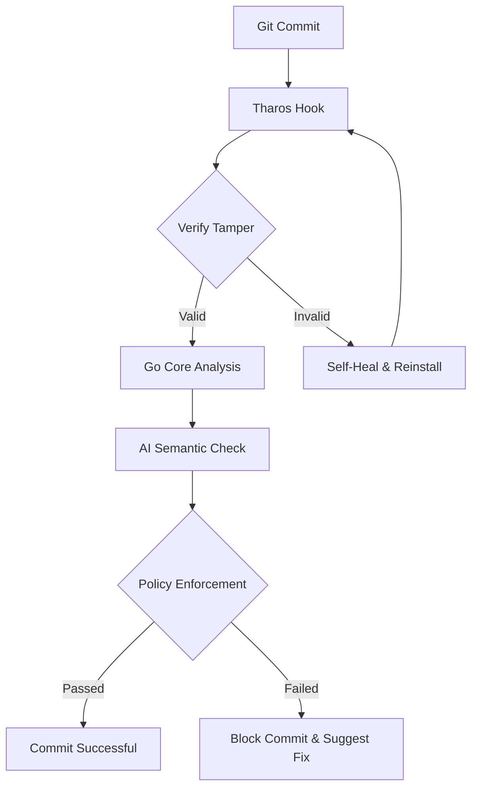

Tharos is designed for high performance and reliability. It uses a hybrid architecture combining a Node.js CLI wrapper with a high-performance Go-based core.

## The Go Core

At the heart of Tharos is the `go-core` engine. This engine handles:

*   **AST Parsing**: Blazing fast parsing of JavaScript and TypeScript files using custom-built tree-sitter bindings.
*   **Semantic Scoring**: Analyzing code structure to detect patterns like logic duplication and security vulnerabilities.
*   **Tamper Evidence**: Using cryptographic signatures to ensure that hooks haven't been modified locally.

## AI Layer

Tharos integrates with local and cloud-based LLMs to provide intelligent feedback during the commit process.

### Local AI (Ollama)

By default, Tharos attempts to use a local LLM via [Ollama](https://ollama.com). This ensures that your code never leaves your machine for trivial checks.

### Cloud AI

For complex analysis or organizational-wide consistency, Tharos can be configured to use OpenAI, Anthropic, or custom internal models.

## Self-Healing Mechanism

One of Tharos's most powerful features is its self-healing capability. If a developer attempts to delete or modify the git hooks in `.git/hooks`, Tharos's watcher or subsequent git operations will automatically detect the discrepancy and reinstall the authorized hooks.

## Process Flow

